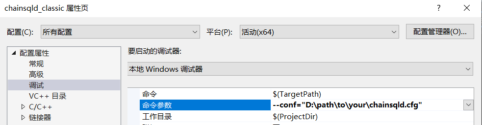
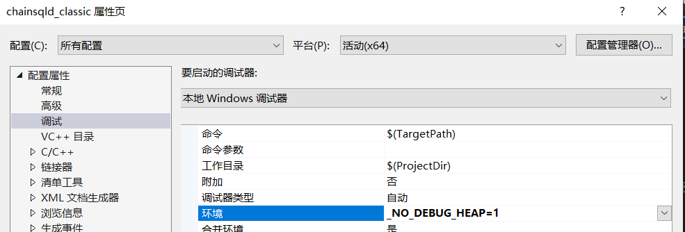

# windows 编译 
## 说明
1. windows下编译一般做调试用，作为运行节点性能较低不推荐
2. 只支持64位编译

## 必备工具及版本
| Component | Minimum Recommended Version |
|-----------|-----------------------|
| [Visual Studio 2017](README.md#install-visual-studio-2017)| 15.5.4 |
| [Git for Windows](README.md#install-git-for-windows)| 2.16.1 |
| [OpenSSL Library](README.md#install-openssl) | 1.0.2u或者1.1.0+ |
| [Goole Protocol Buffers Complier](README.md#install-protocol) | 2.5 |
| [Boost library](README.md#build-boost) | 1.73.0 |
| [CMake for Windows](README.md#optional-install-cmake-for-windows)* | 3.12 |
| [mysql](README.md#install-mysql) | 5.6 |

## 安装工具
### install visual studio 2017
> [Visual Studio 2017 Download](https://www.visualstudio.com/downloads/download-visual-studio-vs) 

### install perl
> 1. [perl download](https://strawberryperl.com/download/5.32.1.1/strawberry-perl-5.32.1.1-64bit.msi)
> 2. 下载安装之后，默认会添加到环境变量，如果没有请手动添加

### install git for windows
> [Git for windows](https://git-scm.com/downloads)

### install cmake for windows
> 编译chainsql需要3.12版本的[cmake for windows](https://cmake.org/download/)

### install protocol
> 1. 编译 chainsqld 需要 2.5.1 以上版本的 [protoc.exe](https://ripple.github.io/Downloads/protoc/2.5.1/protoc.exe)

> 2. 将 protoc.exe 所在目录加入至 PATH 环境变量中

### install openssl
> 1. 下载 [Win64 OpenSSL v1.0.2u或v1.1.1版本](http://slproweb.com/products/Win32OpenSSL.html)
> 2. 安装完 OpenSSL 后，并将 OPENSSL_ROOT_DIR 环境变量设置为 OpenSSL 安装路径

### install boost
> 1. 下载 [boost 1.73 ](http://www.boost.org/users/news/)
> 2. 编译 boost，注意下面的Num Parallel需要指定一个并行编译数量，如：2
```cmd
> cd C:\lib\boost_1_73_0
> bootstrap
> bjam -j<Num Parallel> --toolset=msvc-14.1 address-model=64 architecture=x86 link=static threading=multi runtime-link=shared,static stage --stagedir=stage64
```
> 3. 将 BOOST_ROOT 环境变量设置为 C:\lib\boost_1_73_0

### install mysql
> 1. 下载 [mysql8.0 for windows](https://dev.mysql.com/downloads/installer/)。建议优先选择 x86，64-bit 的压缩包并安装。
> 2. 将 MYSQL_DIR 环境变量设置为 mysql8.0 的安装目录

## 编译 chainsqld
### 下载源码
- git clone git@github.com:ChainSQL/chainsqld.git chainsqld

### 生成 chainsqld 解决方案
> 1. 打开 Developer Command Prompt for VS2017 or VS2019
> 2. 切换 Command Prompt 的工作目录
```
> cd E:/work/chainsqld/Builds/WinVS
```

> 3. 执行 cmake，CMAKE_BUILD_TYPE可以为Release与Debug

```
> # VS2017
> cmake -G"Visual Studio 15 2017 Win64" -DCMAKE_BUILD_TYPE=Debug ../..
> # VS2019
> cmake -G"Visual Studio 16 2019" -A x64  -DCMAKE_BUILD_TYPE=Debug ../..
```

### 编译 chainsqld
> 1. 进入 Builds/WinVS 目录
> 2. 打开 chainsqld.sln
> 3. 如果要运行测试用例，编译 chainsqld-classic 工程；否则编译 chainsqld 工程
> 4. 编译成功后 chainsqld 实例编译至 Build/WinVS/Debug 目录下，运行 chainsqld 实例前需要将 MYSQL_ROOT_DIR/lib 下的 libmysql.dll 拷贝至此 Debug 目录下

## 调试 chainsqld
> 1. 创建一个工作目录用于存储配置文件 chainsqld.cfg，如
```
E:/work/chainsqld/build/chainsqld.cfg
```
> 2. 使用 --conf 参数指定 chainsqld 的配置文件，如

```
--conf="E:/work/chainsqld/build/chainsqld.cfg"
```



> 3. [可选] chainsqld 在使用 Windows Debug Heap 调试程序的时候会导致运行非常慢。我们可以设置 _NO_DEBUG_HEAP 环境变量禁用 Debug Heap，如



## 运行测试用例
> 1. 需要编译 chainsqld_classic 工程
> 2. chainsqld.exe --unittest="Transaction2Sql" --unittest-arg="conf=E:\work\chainsqld\build\chainsqld.cfg"


