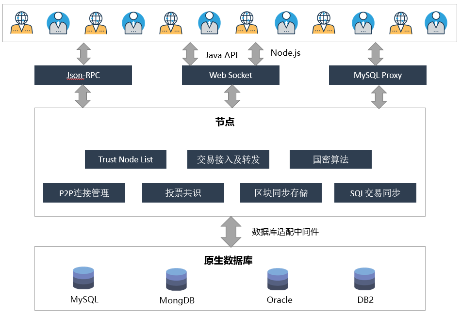

### 1. 引言
- **1.1 编写目的**
  - 该文档旨在设计ChainSQL的架构和技术需求，通过此设计，合并区块链技术和传统分布式数据库的特性，建立一个去中心化的分布式数据库系统
- **1.2 背景**
  - 基于以下技术实现
    - Ripple 的区块链技术实现
    - [RethinkDB](http://rethinkdb.com) 实时分布式数据库
    - MySQL 以及 sqlite

### 2. 总体说明
- **2.1 运行环境**
  - 基于ripple最新源码来定制修改实现区块链的搭建，底层数据库可以直接适配 SQLITE，MySQL，通过mycat间接适配其它各种类型的数据库。上层提供 javascript与java版本的 api 对数据表进行增删改查，用户也可以通过kingshrad使用原生的数据库接口进行数据库表的各种操作。

- **2.2 系统架构**



- **2.3 元素说明**

| 名称 | 定义 |
|------|------|
| 用户 | ripple 中的帐号，数据库表的操作者 |
| 表   | 对应ripple中的特殊资产及新的ledge tree node |
| 读写授权 | 表的所有者赋予其它帐号一定的读写权限，其它帐号才可能操作对应的数据库表 |
| TableList | 自定义的LEDGER NODE TYPES，记录用户创建的表 |
| TableEntry | TableList中TableEntries数据中元素，记录数据库表中的基本信息 |


### 3. 基本功能
- **3.1 数据同步**
  - 各节点在接入网络后，能进行数据的同步，并最终和网络上其它节点的数据保存一致。数据同步后，支持从不同的节点读数据。
- **3.2 当前数据和日志分离**
  - 在LCL记录当前的所有用户的最新数据索引及日志（影响本区块的Transaction及sql）id。各节点可以配置要同步及保留日志数量，例如最近的1000条或全部（full_history）。
- **3.3 表的创建及权限授予**
  - 用户要往链上写入数据记录之前，必须先创建表，定义表的结构（字段属性等）。默认只有创建该表的用户才有此表的读写权限, 其它用户得先让表的所有者赋予一定权限后才能对表进行相应的操作。
- **3.4 选择要同步的表**
  - 节点默认不主动同步自定义表的数据，需要节点在配置文件中指定要同步的表。只要知道表的所有者地址及表名即可同步。如果创建表时选择了加密raw字段，则此处在表名后需要添加拥有同步权限的账户的私钥。如有需要，可以配置同步条件，意为只符合同步条件之前的数据。目前同步条件支持两种，同步到指定条件之前或者同步过程中跳过指定条件。对于同步到指定条件之前，目前条件可以设置为时间及ledger索引，时间支持标准格式，如2016-12-29 12:00:00，ledger索引为整数，如2000。对于同步过程中跳过指定条件，目前条件可以设置为交易Hash及ledger索引，交易Hash唯一标识某一交易，ledger索引为整数，如2000。<br>
        配置的参考格式如下：<br>

    [sync_tables]<br>
    #表的发行帐户地址 表名<br>
    z9VF7yQPLcKgUoHwMbzmQBjvPsyMy19ubs table1<br>
    #表的发行帐户地址 表名 同步到ledgerSeq2000<br>
    z9VF7yQPLcKgUoHwMbzmQBjvPsyMy19ubs table1 2000<br>
    #表的发行帐户地址 表名 同步到2016-12-29 12:00:00<br>
    z9VF7yQPLcKgUoHwMbzmQBjvPsyMy19ubs table2 2016-12-29_12:00:00<br>
    #表的发行帐户地址 表名 解密的私钥<br>
    z9VF7yQPLcKgUoHwMbzmQBjvPsyMy19ubs table3 xxWFBu6veVgMnAqNf6YFRV2UENRd3<br>
    #表的发行帐户地址 表名 跳过ledgerSeq2000<br>
    z9VF7yQPLcKgUoHwMbzmQBjvPsyMy19ubs table3 !2000<br>
    #表的发行帐户地址 表名 跳过指定的交易hash<br>
    z9VF7yQPLcKgUoHwMbzmQBjvPsyMy19ubs talbe4 !860689E0F4A20F4CC0B35804B66486D455DEEFA940666054F780A69F770135C0<br>
    #表的发行帐户地址 表名 解密的私钥 同步到2016-12-29 12:00:00<br>
    z9VF7yQPLcKgUoHwMbzmQBjvPsyMy19ubs talbe4 xxWFBu6veVgMnAqNf6YFRV2UENRd3 2016-12-29_12:00:00<br>
    #表的发行帐户地址 表名 跳过ledgerSeq2000 解密的私钥<br>
    z9VF7yQPLcKgUoHwMbzmQBjvPsyMy19ubs talbe4 !2000 xxWFBu6veVgMnAqNf6YFRV2UENRd3<br>
        
- **3.5 配置数据库**
  - Chainsql支持多种数据库，mysql、sqlite、mycat转换后支持mongodb、db2、sqlserver、PostgreSQL等，本地通过配置文件插件式管理，配置的参考格式如下：<br>

    [sync_db]<br>
    type=mysql       //数据库类型<br>
    host=localhost    //数据库的IP地址<br>
    port=3306        //数据库端口<br>
    user=root        //数据库用户名<br>
    pass=root        //数据库密码<br>
    db=ripple        //数据库中使用的Scheme名称<br>
    charset=utf8     //是否使用UTF-8编码，以支持中文<br>

- **3.6 先入库后共识**
  - 在配置好[sync_db]的情况下，默认情况下先入库后共识处于打开状态，先将数据写入数据库中，事务并不提交。如果共识成功，那么事务提交，否则，事务回滚。在特定情况下，可以将其关闭。配置的参考格式如下：<br>

    [sync_db]<br>
    first_storage=0<br>

    使用本功能的前提是按照3.5节配置好数据库。

- **3.7 自动同步开关**
  - 此开关为关闭状态时，只同步[sync_tables]中填写的表。对于某些情况，需要实时同步区块链中新创建的表，那么可以将此开关打开。配置的参考格式如下：<br>

    [auto_sync]<br>
    1　　　　#1为打开此开关，0为关闭此开关

- **3.8 通过ChainSQL API对表的写操作**
  - 表的写操作（添加记录、修改记录、删除记录），需要发到全网经过共识验证后才能存档。用户应该在每次写操作后，对操作的结果进行确认后，再进行其它读写操作

- **3.9 通过ChainSQL API对表的读操作**
  - 表的读操作，直接传入底层读本地的数据库

- **3.10 数据的回滚**
  - 可以根据日志表进行数据的回滚，或整个表的重建

- **3.11 事务的支持**
  - 上层API提供事务操作的接口，使用本功能的前提是按照3.5配置好本地数据库，然后按照3.7打开自动同步开关。
 
- **3.12 Raw字段加密**
  - 如果出于保密性考虑，对于某张表的操作不想让其它用户看到，可以选择在操作表时对Raw字段加密，密码在创建表时随机生成，用生成的密码对Raw字段进行对称加密，密码使用公钥加密存放，只有表的创建者与被授权的用户可以用自己的私钥去解密，拿到解密后的密码之后再对Raw字段进行对称解密，才能看到Raw字段的明文。
  -  如果需要同步某张使用Raw字段加密的表，需要在节点的配置文件中配置拥有读权限的用户私钥，配置格式参考3.4。
  - 需要注意的是，对于先入库功能，需要在配置先入库的节点提前配置用户私钥，对于事务类型的交易，因为交易中会出现查询类型的交易，其中包含加密的raw字段，所以需要在共识节点配置用户私钥才能共识通过。

- **3.13 Strict模式**
  - 在限制模式下，语句共识通过的条件是期望的表的快照HASH与预期一致。
  - 第一次建表时，快照HASH=HASH(建表的Raw)。
  - 增删改操作时，快照HASH=HASH(上次的快照HASH+操作的Raw)。
  - 授权、改表名、删除表时不修改快照HASH。
  
- **3.14 表的行级控制(P2)**
  - 表的增删改查支持行级控制
  - 插入表可设置默认填写字段（账户字段、交易哈希字段）
  - 插入表可限制单个账户的插入条数
  - 更新表可限制允许更新的字段
  - 更新、删除、查询表可限制条件，规则参见8.Raw字段详解
  
- **3.15 表、交易的订阅(P2)**
  - 通过提供表的创建者账户地址与表名订阅一张表
  - 订阅表成功后，与表相关的交易结果（共识或入库）都会通过回调返回
  - 通过提供交易哈希订阅单个交易（支持Ripple始交易类型）
  - 交易订阅成功后交易的共识结果与入库结果（Chainsql）会通过回调返回
  - 取消订阅必需与要取消的订阅在同一个websocket连接中执行
 
- **3.16 表的重建(P2)**
  - 通过表的重建功能可对区块链进行“瘦身”
  - 可通过表的重建功能将表的创建点移到新建区块
  - 重建表之前通过dump导出表相关交易
  - 表重建后可通过重新发送交易重建表的数据

- **3.17 dump**
  - 将数据库表的操作以文档的形式进行记录，可以分多次对同一张表进行dump。
  - 实现方式：通过Commandline方式进行操作。
  - 命令形式：chainsqld “para1” “para2”
  - Para1 : 参考数3.4节中的设置，与“数据库表的同步设置”保持一致。
  - Para2 : 数据库表操作保存的目标路径。
  - 例：chainsqld t_dump “z9VF7yQPLcKgUoHwMbzmQBjvPsyMy19ubs table1 2000” “/chainsql/table1.dmp” 


- **3.18 审计**
  - 对数据库表的指定条目特定字段进行追根溯源，将所有影响了指定条目特定字段的数据库表操作都记录下来。
  - 实现方式：通过Commandline方式进行操作。
  - 命令形式：chainsqld “para1” “para2” “para3”
  - Para1 : 参考数3.4节中的设置，与“数据库表的同步设置“保持一致。
  - Para2 :  sql查询语句，表明指定条目特定字段，如“select name, salary from - table1 where id=1”，代表审计数据库表table1中id=1的条目的name与salary字段，所有与对数据库表table1的操作中影响到id=1的条目中的name与salary字段的操作将被记录。
  - Para3 : 数据库表操作保存的目标路径。
  - 例：chainsqld t_audit “z9VF7yQPLcKgUoHwMbzmQBjvPsyMy19ubs table1 2000” “select name, salary from table1 where id=1” “/chainsql/table1.dmp” 

- **3.19 Chainsql链瘦身操作步骤**<br>
  前提：节点保存链上的所有表且所有表已经是最新的，并且在清理数据期间没有别的对表的操作。<br>
操作步骤：
  1. 用dump命令将表导出至文件存档，以备以后检索
  2. 调用API接口发送recreate类型的交易
  3. 依次处理网络中的所有节点，每个节点均按照下列流程处理：
      - 停止节点程序
      - 将节点的配置文件中[ledger_history]改为512.
      - 定位程序生成的区块数据文件存放路径（[node_db]和[database_path]），将文件目录删除。默认为当前程序目录下db和rocksdb目录
      - 启动节点程序，用server_info（使用说明见附录）查看，确定节点正确同步上
  4. 清理实际存储数据库：将每个节点连接的实际数据库清空，对于没有连接数据库的节点则无需此操作
  5. 修改网络中所有节点配置，依次重启：
      - 将网络中的所有节点的配置文件中[ledger_history]均改回full，然后节点依次重启，每一个节点重启后用server_info查看，确定节点正确同步上区块，直至全部处理完毕
  6. 在本地配置好同步的表，然后启动本地节点，开始同步，待确认表建立完成后，进行下一步
  7. 客户准备好需要恢复的数据交易，发往网上参与共识，待共识通过后，至此对区块链的数据清理和恢复完成

### 4. 性能指标
- **4.1 数据的一致性**
  - 各节点在完成同步后，数据的一致性要达到100%，多节点同时读写的情况下，数据的一致性不小于90%

- **4.2 数据的可靠性**
  - 单节点写入时，全网数据的可靠性达到100%，单点非法篡改数据不会同步到其它节点

- **4.3 写入速度**
  - 支持每秒万级的写操作

### 5. 结构定义
- **5.1 自定义的表: SyncTableState**
  - 该表用于记录用户需要同步的表的状态<br>

| Field | Internal Type | Description |
|-------|---------------|-------------|
| Owner | String | 所有者AccountID |
| TableName | String | 要同步的表名 |
| TableNameInDB | String | 要同步的实际表名 |
| TxnLedgerHash | String | 同步到的影响该表的交易所在ledger hash |
| TxnLedgerSeq | String | 同步到的影响该表的交易ledger index |
| LedgerHash | String | 同步到的ledger hash |
| LedgerSeq | String | 同步到的ledger index |
| TxnUpdateHash |String | 同步到的交易Hash |
| deleted | String | 标识此表是否已经删除（0-未删除 1-已经删除） |
| AutoSync | String | 标识此表是否是自动同步（0-不是 1-是） |
| TxnLedgerTime | String | 标识交易发生时的时间 |
| PreviousCommit | String | 该表的上次快照点 |

- **5.2 自定义的LEDGER NODE TYPES：TableList**
  - 新加一种LEDGER NODE TYPES（TableList），用于存储用户的表数据。TableList node定义如下：

| Field | JSON Type | Internal Type | Description |
|-------|-----------|---------------|-------------|
| OwnerNode | String | UInt64 | A hint indicating which page of the owner directory links to this node, in case the directory consists of multiple nodes | 
| PreviousTxnID | String |Hash256 | The identifying hash of the transaction that most recently modified this node |
| PreviousTxnLgrSeq |Number | UInt32 | The index of the ledger that contains the transaction that most recently modified this node |
| TableEntries | Array | Array | An array of TableEntry objects |

&emsp;　　　TableEntry Object定义如下:

| Field | JSON Type | Internal Type | Description |
|-------|-----------|---------------|-------------|
| TableName | String|  Blob| 数据库表名 |
| NameInDB | String | Hash128 | 对应底层数据库中实际的表名,（LedgerSequence+OwnerAccountID+表名） |
| Deleted | Bool | Bool | 标示表是否被删除 |
| CreateLgrSeq | Number | UInt32 | 表创建交易所在ledger的前一个ledger 序列号 |
| CreatedLedgerHash | Number | Hash256 | 表创建交易所在ledger的前一个ledger HASH |
| CreatedTxnHash | Number | Hash256 | 表创建交易HASH |
| TxnLgrSeq | Number | UInt32 | 本交易的ledger序列号 |
| TxnLgrHash | String | Hash256 | 本次交易的ledger HASH |
| PreviousTxnLgrSeq | Number | UInt32 | 上次交易的ledger序列号 |
| PreviousTxnLgrHash | String | Hash256 | 上次交易的ledger HASH |
| TxCheckHash | String | Hash256 | 上次TxCheckHash+本次交易raw字段，再进行哈希 |
| Users | Array | Array | 授权用户列表 |
| Users[] | Object | Object | An association of an address and roles |
| Users[].Account | String | AccountID | 被授予对应权限的ripple账户地址 |
| Users[].Flags | Number | UInt32 | A bit-map of boolean flags enabled for this account. 用户拥有的权限flags |
| Users[].Token | String | Blob | Cipher encrypted by this user's publickey. 对Raw字段加解密密码使用用户公钥加密后的密文 |

&emsp;　　　Table Role Flags定义如下:

| Flag Name | Hex Value | Decimal Value |
|-----------|-----------|---------------|
| lsfSelect | 0x00010000 | 65536 |
| lsfInsert | 0x00020000 | 131072 |
| lsfUpdate | 0x00040000 | 262144 |
| lsfDelete | 0x00080000 | 524288 |
| lsfExecute | 0x00100000 | 1048576 |

- **5.3 自定义的Transactions：TableListSet**
  - TableListSet Transactions 对应创建表、删除表、表改名、表授权、表重建等操作，只有表的创建者可以删除及授权等其它操作<br>

| Field | JSON Type | Internal Type | Description |
|-------|-----------|---------------|-------------|
| Tables | Array | Array | 必填，本次操作涉及到的表名 |
| Table[] | Object | Object | 必填，表元素 |
| Table[].TableName | String | Blob | 必填，上层表名 |
| Table[].NameInDB | String | Hash160 | 选填，实际表名 |
| Table[].TableNewName | String | Blob | 选填，如果有则是表改名操作，如果是NULL则是删除表 |
| User | String | AccountID | 选填，被授予对应权限的ripple账户地址 |
| Flags | Number | UInt32 | 选填，公用字段，用来记录用户被授予的权限 |
| OpType | Number | UInt32 | 必填，操作类型， 1：建表，2：删表，3：改表名，10：验证断言，11：授权，12：表重建，13：多链整合|
| Raw | String | Blob | 选填，建表/删表的sql或json |
| TxCheckHash | String | Hash256 | 选填，strict模式时设置的校验|
| Token | String | Blob | 选填，建表/授权表用户公钥加密的密文 |
| OperationRule | Json Object | Blob | 行级控制规则 |

    备注：
        建表要填写的字段：Tables，Raw，Token
        删表要填写的字段：Tables，TableNewName=null
        改名要填写的字段：Table，TableNewName
        授权要填写的字段：Table，User，Flags，Token
        取消授权要填写的字段：Table，User，Flags=0

- **5.4 自定义的Transactions：SQLStatement**
  - SQLStatement Transactions 对应对表的select, insert, delete, update等操作<br>

|Field | JSON Type | Internal Type | Description |
|------|-----------|---------------|-------------|
| Owner | String | AccountID | 必填，表的创建者 |
| Tables | Array | Array | 必填，本次操作涉及到的表名 |
| Flags | Number | UInt32 | 必填，公用字段，操作需要的权限 |
| OpType | Number | UInt32 | 必填，操作类型，6:插入记录, 8:更新记录,9:删除记录 |
| AutoFillField | String | Blob | 选填，指定自动填充的字段 |
| Raw | String | Blob | 必填，select/insert/update/delete的sql或json |
| TxCheckHash | String | Hash256 | 选填，strict模式时设置的校验|

- **5.5 自定义的Transactions：SQLTransaction**
  - SQLTransaction Transactions 对应对表的事务操作<br>

|Field | JSON Type | Internal Type | Description |
|------|-----------|---------------|-------------|
| Statements | Array | Array | 必填，事务操作json数组 |
| Statements[] | Object | Object | 必填，事务操作json对象 |
| Statements[].Tables | Array | Array | 必填，本次事务操作涉及的表名等信息 |
| Statements[].Tables.Table[] | Object | Object | 必填，表元素 |
| Statements[].Tables.Table[].TableName | String | Blob | 必填，上层表名 |
| Statements[].Tables.Table[].NameInDB | String | Hash160 | 选填，实际表名 |
| Statements[].Tables.Table[].TableNewName | String | Blob | 选填，如果有则是表改名操作，如果是NULL则是删除表 |
| Statements[].User | String | AccountID | 选填，被授予对应权限的ripple账户地址 |
| Statements[].Flags | Number | UInt32 | 选填，公用字段，用来记录用户被授予的权限 |
| Statements[].OpType | Number | UInt32 | 必填，操作类型， 1：建表, 2：删表, 3：改表名, 6:插入记录, 8:更新记录, 9:删除记录, 10.验证断言 |
| Statements[].AutoFillField | String | Blob | 选填，指定自动填充的字段 |
| Statements[].Raw | String | Blob | 选填，建表/删表的sql或json |
| Statements[].TxCheckHash | String | Hash256 | 选填，strict模式时设置的校验|

### 6. RPC 接口

&emsp; 下面的RPC接口中NameInDB为选填字段，底层会根据需要自动补上NameInDB。最后签名提交的tx_json里必须有正确的NameInDB。Fee和Sequence字段同理。
- **6.1 g_dbname得到表名**
  - 非transtraction请求，得到指定用户表的在本地数据库中的实际表名。首先从ledgerMaster中获取，如果表不存在，则生成一个新的。生成规则：hex(hash(currentLedgerSequence + accountId + tableName))<br>
        Request Format:<br>
```json
{
    "method": "g_dbname",
    "params": [
        {
            "offline": true,
            "tx_json": {
                "Account": "zHb9CJAWyB4zj91VRWn96DkukG4bwdtyTh",
                "TableName": "ExampleName"
            }
        }
    ]
}
```
&emsp;　　　Response Format:

```json
{
    "result":{
        "nameInDB":"802BF2572F6E0673F70E6F1D0BE59BB6C2E7EFAC",
        "status":"success"
    }
}
```
    
- **6.2 t_create 创建表**
  - 对应TableListSet请求，先本地验证权限后，然后再发至全网验证并共识<br>
        Request Format:<br>
```json
{
  "method": "t_create",
  "params": [
    {
      "offline": false,
      "secret": "x████████████████████████████",
      "tx_json": {
        "TransactionType": "TableListSet",
        "Account": "zHb9CJAWyB4zj91VRWn96DkukG4bwdtyTh",
        "Tables": [
          {
            "Table": {
              "TableName": "ExampleName"
            }
          }
        ],
        "OpType": 1,
        "Raw": [
          {
            "field": "id",
            "type": "int",
            "length": 11,
            "PK": 1,
            "NN": 1,
            "UQ": 1,
            "AI": 1
          },
          {
            "field": "account",
            "type": "varchar"
          },
          {
            "field": "txid",
            "type": "varchar"
          },
          {
            "field": "age",
            "type": "int"
          }
        ],
        "OperationRule": {
          "Insert": {
            "Condition": {
              "account": "$account",
              "txid": "$tx_hash"
            },
            "Count": {
              "AccountField": "account",
              "CountLimit": 5
            }
          },
          "Update": {
            "Condition": {
              "$or": [
                {
                  "age": {
                    "$le": 28
                  }
                },
                {
                  "id": 2
                }
              ]
            },
            "Fields": [
              "age"
            ]
          },
          "Delete": {
            "Condition": {
              "account": "$account"
            }
          },
          "Get": {
            "Condition": {
              "id": {
                "$ge": 3
              }
            }
          }
        },
        "Confidential": false,
        "StrictMode": true
      }
    }
  ]
}
```
    备注：
        Confidential：可选字段,默认为false,对于加密表，自动添加Token字段到tx_json
        StrictMode：可选字段，默认为false
        OperationRule:可选字段，需要注意的点如下：
            1.不可与Confidential:true同时使用
            2.Insert指定了Count条件，则Delete中也需要指定同样的账户
        NN： Not Null标识
        UQ：唯一键标识
        AI：自增标识
        Index：索引标识
&emsp;　　　Response Format:
    
```json
{
    "result": {
        "engine_result": "tesSUCCESS",
        "engine_result_code": 0,
        "engine_result_message": "The transaction was applied. Only final in a validated ledger.",
        "status": "success"
    },
    "tx_hash": "C26DE76A67BE9A0D3216578F2484671F57BF0758E65079664604435BA9D839F8"
}
```

- **6.3 t_drop 删除表**
  - 对应TableListSet请求，先本地验证权限后，然后再发至全网验证并共识<br>
        Request Format:<br>
```json
{
  "method": "t_drop",
  "params": [
    {
      "offline": false,
      "secret": "x████████████████████████████",
      "tx_json": {
        "TransactionType": "TableListSet",
        "Account": "zHb9CJAWyB4zj91VRWn96DkukG4bwdtyTh",
        "Tables": [
          {
            "Table": {
              "TableName": "ExampleName"
            }
          }
        ],
        "OpType": 2
      }
    }
  ]
}
```
&emsp;　　　Response Format 同上

- **6.4 t_rename 表改名**
  - 对应TableListSet请求，先本地验证权限后，然后再发至全网验证并共识<br>
        Request Format:<br>
```json
{
  "method": "t_rename",
  "params": [
    {
      "offline": false,
      "secret": "x████████████████████████████",
      "tx_json": {
        "TransactionType": "TableListSet",
        "Account": "zHb9CJAWyB4zj91VRWn96DkukG4bwdtyTh",
        "Tables": [
          {
            "Table": {
              "TableName": "aac",
              "TableNewName": "ExampleNewName"
            }
          }
        ],
        "OpType": 3
      }
    }
  ]
}
```
&emsp;　　　Response Format 同上

- **6.5 t_grant 授权其他用户**
  - 对应TableListSet请求，先本地验证权限后，然后再发至全网验证并共识<br>
        Request Format:<br>
```json
{
  "method": "t_grant",
  "params": [
    {
      "offline": false,
      "secret": "x████████████████████████████",
      "tx_json": {
        "TransactionType": "TableListSet",
        "Account": "zHb9CJAWyB4zj91VRWn96DkukG4bwdtyTh",
        "Tables": [
          {
            "Table": {
              "TableName": "ExampleName"
            }
          }
        ],
        "OpType": 11,
        "User": "z9VF7yQPLcKgUoHwMbzmQBjvPsyMy19ubs",
        "PublicKey": "cBRmXRujuiBPuK46AGpMM5EcJuDtxpxJ8J2mCmgkZnPC1u8wqkUn",
        "Raw": [
          {
            "select": true,
            "insert": true,
            "update": true,
            "delete": true
          }
        ]
      }
    }
  ]
}
```
    备注：
        PublicKey字段是可选的，加密方式创建的表在授权操作中需要提供用用户公钥加密过的密码的密文。
        如果要取消对某账户的权限，可重新做一次授权，在原有权限基础上对交易中Raw中的权限进行增删。
        对账户zzzzzzzzzzzzzzzzzzzzBZbvji授权表示对所有人进行授权，对所有人权限后还可单独对某一用户授权。
        已经被授权过的单一用户不受“所有人”再授权的影响。
&emsp;　　　Response Format 同上

- **6.6 r_insert 插入新记录**
  - 对应SQLStatement请求，先本地验证权限后，然后再发至全网验证并共识<br>
        Request Format:<br>
```json
{
  "method": "r_insert",
  "params": [
    {
      "offline": false,
      "secret": "x████████████████████████████",
      "tx_json": {
        "TransactionType": "SQLStatement",
        "Account": "zHb9CJAWyB4zj91VRWn96DkukG4bwdtyTh",
        "Owner": "zHb9CJAWyB4zj91VRWn96DkukG4bwdtyTh",
        "Tables": [
          {
            "Table": {
              "TableName": "ExampleName"
            }
          }
        ],
        "Raw": [
          {
            "id": 1,
            "name": "test",
            "age": "11"
          },
          {
            "id": 2,
            "name": "hello",
            "age": "12"
          }
        ],
        "OpType": 6,
        "StrictMode": false    //可选字段: 不设置表示不使用strictMode
      }
    }
  ]
}
```
&emsp;　　　Response Format 同上

- **6.7 r_update 更新记录**
  - 对应SQLStatement请求，先本地验证权限后，然后再发至全网验证并共识<br>
        Request Format:<br>
```json
{
  "method": "r_update",
  "params": [
    {
      "offline": false,
      "secret": "x████████████████████████████",
      "tx_json": {
        "TransactionType": "SQLStatement",
        "Account": "zHb9CJAWyB4zj91VRWn96DkukG4bwdtyTh",
        "Owner": "zHb9CJAWyB4zj91VRWn96DkukG4bwdtyTh",
        "Tables": [
          {
            "Table": {
              "TableName": "ExampleName"
            }
          }
        ],
        "Raw": [
          {
            "name": "testNew"
          },
          {
            "id": 1,
            "name": "test"
          },                   //内部是and的关系
          {
            "id": 2
          }                    //与上一行之间是or的关系
        ],
        "OpType": 8,
        "StrictMode": true    //可选字段: 不设置表示不使用strictMode
      }
    }
  ]
}
```
&emsp;　　　Response Format 同上
    
- **6.8 r_delete 删除记录**
  - 对应SQLStatement请求，先本地验证权限后，然后再发至全网验证并共识<br>
        Request Format:<br>
```json
{
  "method": "r_delete",
  "params": [
    {
      "offline": false,
      "secret": "x████████████████████████████",
      "tx_json": {
        "TransactionType": "SQLStatement",
        "Account": "zHb9CJAWyB4zj91VRWn96DkukG4bwdtyTh",
        "Owner": "zHb9CJAWyB4zj91VRWn96DkukG4bwdtyTh",
        "Tables": [
          {
            "Table": {
              "TableName": "ExampleName"
            }
          }
        ],
        "Raw": [
          {
            "id": 1
          },
          {
            "name": "test"
          },                         //内部是and的关系
          {
            "id": 2
          }                          //与上一行之间是or的关系
        ],
        "OpType": 9,
        "StrictMode": true
      }
    }
  ]
}
```
&emsp;　　　Response Format 同上

- **6.9 r_get 查询记录**
  - 非transtraction请求，直接查询本地节点的数据<br>
        Request Format:<br>
```json
{
  "method": "r_get",
  "params": [
    {
      "offline": true,
      "tx_json": {
        "Owner": "zHb9CJAWyB4zj91VRWn96DkukG4bwdtyTh",
        "Account": "zHb9CJAWyB4zj91VRWn96DkukG4bwdtyTh",
        "Tables": [
          {
            "Table": {
              "TableName": "ExampleName"
            }
          }
        ],
        "Raw": [
          [
            "id",
            "name"
          ],
          {
            "id": 1,
            "name": "test"
          },
          {
            "id": 2
          }
        ],
        "OpType": 7,
        "TableFlags": 65536
      }
    }
  ]
}
```
&emsp;　　　Response Format:
    
```json
{
    "result": {
        "diff": 0,
        "lines": [
            {
                "id": 2,
                "name": "hello"
            }
        ],
        "status": "success"
    }
}
```

&emsp;　　　支持多表联合查询：<br>
&emsp;　　　　内连接、左连接、右连接
```json
{
 "Tables": [
          {
            "Table": {
              "TableName": "ExampleName1",
              "Alias": "u",
              "join": "inner"   //可为left、right
            }
          },
          {
            "Table": {
              "TableName": "ExampleName2",
              "Alias": "o"
            }
          }
        ],
        "Raw": [
          [
            "u.id",
            "o.name"
          ],
          {
            "$join": {
              "u.id": {
                "$eq": "o.id"
              }
            }
          },
          {
            "$and": [
              {
                "u.id": 1
              },
              {
                "o.age": 33
              }
            ]
          }
        ]
}
```
&emsp;　　　Response Format:
    
```json
{
    "result": {
        "diff": 0,
        "lines": [
            {
                "id": 1,
                "name": "hello"
            }
        ],
        "status": "success"
    }
}
```
    备注：
        diff字段用来指示查询到的数据的LedgerSeq和当前链LedgerSeq的差值
        0：最新
        N：落后N个区块
<br>

- **6.10 t_sqlTxs 事务操作**
  - 对应SQLTransaction请求，先本地验证权限后，然后再发至全网验证并共识<br>
        Request Format:<br>
```json
{
  "method": "t_sqlTxs",
  "params": [
    {
      "offline": false,
      "secret": "x████████████████████████████",
      "tx_json": {
        "TransactionType": "SQLTransaction",
        "Account": "zHb9CJAWyB4zj91VRWn96DkukG4bwdtyTh",
        "Statements": [
          {
            "Tables": [
              {
                "Table": {
                  "TableName": "EName1",
                  "NameInDB": "48C80D2CF136054DB6F0116D4833D4DAD1D4CED5"   //可以不填
                }
              }
            ],
            "OpType": 1,
            "Raw": [
              {
                "field": "id",
                "type": "int"
              },
              {
                "field": "age",
                "type": "int"
              }
            ]
          },
          {
            "Owner": "zHb9CJAWyB4zj91VRWn96DkukG4bwdtyTh",
            "Tables": [
              {
                "Table": {
                  "TableName": "EName1",
                  "NameInDB": "48C80D2CF136054DB6F0116D4833D4DAD1D4CED5"
                }
              }
            ],
            "OpType": 10,
            "Raw": [
              {
                "$IsExisted": 1
              }
            ]
          },
          {
            "Owner": "zHb9CJAWyB4zj91VRWn96DkukG4bwdtyTh",
            "Tables": [
              {
                "Table": {
                  "TableName": "EName1",
                  "NameInDB": "48C80D2CF136054DB6F0116D4833D4DAD1D4CED5"
                }
              }
            ],
            "Raw": [
              {
                "id": 1,
                "age": 20
              },
              {
                "id": 2,
                "age": "30"
              }
            ],
            "OpType": 6,
            "Flags": 65536,
            "StrictMode": true
          },
          {
            "Owner": "zHb9CJAWyB4zj91VRWn96DkukG4bwdtyTh",
            "Tables": [
              {
                "Table": {
                  "TableName": "EName1",
                  "NameInDB": "48C80D2CF136054DB6F0116D4833D4DAD1D4CED5"
                }
              }
            ],
            "Flags": 65536,
            "OpType": 10,
            "Raw": [
              {
                "$RowCount": 1
              },
              {
                "id": 1,
                "age": "20"
              }
            ]
          }
        ]
      }
    }
  ]
}
```
&emsp;　　　Response Format:
    
```json
{
    "result": {
        "engine_result": "tesSUCCESS",
        "engine_result_code": 0,
        "engine_result_message": "The transaction was applied. Only final in a validated ledger.",
        "status": "success"
    },
    "tx_hash": "1009C75C1C667373C39921395D57D0180C00CC882785C74A30109459E08A88C4"
}
```

### 7. WebSocket 接口
- **7.1 g_dbname 得到表名**
  - 非transtraction请求，得到指定用户表的在本地数据库中的实际表名。首先从ledgerMaster中获取，如果表不存在，则生成一个新的。生成规则：hex(hash(currentLedgerSequence + accountId + tableName))<br>
        Request Format:<br>
```json
{
    "command": "g_dbname",
    "tx_json": {
           "Account": "z9VF7yQPLcKgUoHwMbzmQBjvPsyMy19ubs",
           "TableName": "ExampleName"
      }
}
```
&emsp;　　　Response Format:

```json
{
    "result":{
        "nameInDB":"802BF2572F6E0673F70E6F1D0BE59BB6C2E7EFAC",
        "status":"success"
    }
}
```

- **7.2 g_txCheckHash**
  - 获取某张表的当前快照hash，非transtraction请求<br>
        Request Format:<br>
```json
{
    "command": "g_getcheckhash",
    "tx_json": {
           "Account": "zHb9CJAWyB4zj91VRWn96DkukG4bwdtyTh",
           "TableName": "ExampleName"
      }
}
```
&emsp;　　　Response Format:

```json
{
    "result": {
    "status": "success",
    "txCheckHash": "EBA944B14C79A9D081AA1FBF7762D09289B19770E58CAFC119D3E60C9B3771C5"
  }
}

```

- **7.3 t_prepare**<br>
  - 非transtraction请求，对于需要使用StrictMode或需要raw字段加密的表进行创建/授权/增删改操作之前的准备工作。
  - 加解密：创建表时传入Confidential字段为true表示这张表需要raw字段加字，对于创建表与授权表，会在tx_json中添加Token字段，对于创建表与增删改操作，会将tx_json中的Raw字段加密。因为是在websocket上层签名前调用，会有一些冗余字段。
  - 进行增删改操作时，传入StrictMode字段为true表示需要使用Strict模式来进行表操作,返回Json中会添加TxCheckHash字段，表示交易校验哈希值，将这一字段添加到交易中后再进行签名操作<br>
    Request Format:
```json
{
  "command": "t_prepare",
  "tx_json": {
    "TransactionType": "TableListSet",
    "Account": "rBuLBiHmssAMHWQMnEN7nXQXaVj7vhAv6Q",
    "Owner": "rf1BiGeXwwQoi8Z2ueFYTEXSwuJYfV2Jpn",
    "Tables": [
      {
        "Table": {
          "TableName": "EName2"         //hex形式
        }
      }
    ],
    "TableNewName": "tableNewName",     //hex形式
    "PublicKey": "cBP8JEiNXr3a9nnBFDNKKzAoGNezoXzsa1N8kQAoLU5F5HrQbFvs",
    "Raw": [
      {
        "field": "id",
        "type": "int",
        "length": 11,
        "PK": 1,
        "NN": 1,
        "UQ": 1,
        "AI": 1
      },
      {
        "field": "age",
        "type": "int"
      }
    ],                                 //hex形式
    "Flags": 65536,
    "StrictMode": true,
    "OpType": 1
  }
}
```
    备注：
        Raw字段、TableName字段以hex形式传入
        TransactionType与OpType字段的取值根据实际操作来修改
        创建表用到的字段：Secret,TransactionType,Account,Tables,Raw,OpType
        授权表用到的字段：Secret,TransactionType,Account,Tables,PublicKey,Flags,Optype
        增删改操作的字段：Secret,TransactionType,Account,Tables,Raw,OpType

&emsp;　　　Response Format:

```json
{
  "result": {
    "status": "success",
    "tx_json": {
      "Account": "zHb9CJAWyB4zj91VRWn96DkukG4bwdtyTh",
      "Flags": 65536,
      "OpType": 1,
      "Owner": "zHb9CJAWyB4zj91VRWn96DkukG4bwdtyTh",
      "PublicKey": "cBP8JEiNXr3a9nnBFDNKKzAoGNezoXzsa1N8kQAoLU5F5HrQbFvs",
      "Raw": [
        {
          "AI": 1,
          "NN": 1,
          "PK": 1,
          "UQ": 1,
          "field": "id",
          "length": 11,
          "type": "int"
        },
        {
          "field": "age",
          "type": "int"
        }
      ],                                 //hex形式
      "TableNewName": "tableNewName",    //hex形式
      "Tables": [
        {
          "Table": {
            "NameInDB": "4728A301542B8CE647D41A8D000F35900AEB3E09",
            "TableName": "EName2"       //hex形式
          }
        }
      ],
      "TransactionType": "TableListSet",
      "TxCheckHash": "9336DE2AB6C901312CF23957462FA8596F546B4F76191F0578F80EC6C8CB1C79"
    }
  }
}
```
    备注：
        Token：创建表与操作授权表操作会添加
        Raw：所有提供Raw字段的操作（创建表/增删改），Raw字段会被加密
		
- **7.4 g_userToken**
  - 得到用户对应某张表的token，得到token后，需用用户自己的私钥去解密，得到密码明文，然后用密码明文对raw字段进行AES对称加密<br>
        Request Format:<br>
```json
{
  "command": "g_userToken",
  "tx_json": {
    "Owner": "zHb9CJAWyB4zj91VRWn96DkukG4bwdtyTh",
    "User": "z9VF7yQPLcKgUoHwMbzmQBjvPsyMy19ubs",
    "TableName": "ExampleNewName"
  }
}
```
&emsp;　　　Response Format:
    
```json
{
  "result": {
    "status": "success",
    "token": "027C72E33DC7B0051C3528EB6261908CD281832FFA5C0049FD624F2FABECADB53225F564D51DFF64CF7FA27FA6330D05165AAAC5C4186F12BD464838C5CC003D7E435E6FC36BDC4D470BFBDF362A7BA497DC0DF18C25BF0CDE48024B4D23917C0A197A3A4C8471564417B07DB19256A174"
  }
}
```
	备注：
	    Token:16进制的密码的密文
	    status: success：成功(表未加密或者加密了成功返回不为空的Token)
        error:失败（表加密了但未对当前用户授权）
	    error_message:错误信息
	
    
- **7.5 t_create 创建表**
  - 对应TableListSet请求，用帐户对应的私钥将下面JSON语句本地签名后，然后再调用7.15中的submit接口将交易发往全网共识<br>
        Request Format:<br>
```json

 {
  "TransactionType": " TableListSet",
  "Account": "rf1BiGeXwwQoi8Z2ueFYTEXSwuJYfV2Jpn",
  "Tables": [
    {
      "Table": {
        "TableName": "ExampleName"
      }
    }
  ],
  "Token": "DC5903F61E74706D42C28A41205CA69DE9EF87B93DA8742B0841D9013F4F6CD7FAE73E0A8C92C8F15B52FA362D9C95A9145AA4DD43F5A060",
  "OpType": 1,
  "Raw": [
    {
      "field": "id",
      "type": "int",
      "length": 11,
      "PK": 1,
      "NN": 1,
      "UQ": 1,
      "AI": 1
    },
    {
      "field": "age",
      "type": "int"
    }
  ]
}

```
    备注：
        Token字段是可选的，如果不为空则说明是用加密方式创建表，对应的Raw字段就是密文
        PK：主键标识
        NN： Not Null标识
        UQ：唯一键标识
        AI：自增标识
        Index：索引标识
&emsp;　　　Response Format:

```json
{ 
  "resultCode": "tesSUCCESS",
  "resultMessage": "The transaction was applied. Only final in a validated ledger." 
}
```


- **7.6 t_drop 删除表**
  - 对应TableListSet请求，用帐户对应的私钥将下面JSON语句本地签名后，然后再调用7.15中的submit接口将交易发往全网共识<br>
        Request Format:<br>       
```json
{
  "TransactionType": "TableListSet",
  "Account": "rf1BiGeXwwQoi8Z2ueFYTEXSwuJYfV2Jpn",
  "Tables": [
    {
      "Table": {
        "TableName": "ExampleName",
        "NameInDB": "48C80D2CF136054DB6F0116D4833D4DAD1D4CED5"
      }
    }
  ],
  "OpType": 2,
  "Fee": 12,
  "Sequence": 2
}

```        
&emsp;　　　Response Format 同上

- **7.7 t_rename 表改名**
  - 对应TableListSet请求，用帐户对应的私钥将下面JSON语句本地签名后，然后再调用7.15中的submit接口将交易发往全网共识<br>
        Request Format:<br>
```json
{
  "TransactionType": "TableListSet",
  "Account": "rf1BiGeXwwQoi8Z2ueFYTEXSwuJYfV2Jpn",
  "Tables": [
    {
      "Table": {
        "TableName": "ExampleName",
        "TableNewName": "ExampleNameNew"
      }
    }
  ],
  "OpType": 3,
  "Fee": 12,
  "Sequence": 2
}

``` 
&emsp;　　　Response Format 同上

- **7.8 t_grant 授权其他用户**
  - 对应TableListSet请求，用帐户对应的私钥将下面JSON语句本地签名后，然后再调用7.15中的submit接口将交易发往全网共识<br>
        Request Format:<br>
```json
{
  "TransactionType": "TableListSet",
  " Account ": "zf1BiGeXwwQoi8Z2ueFYTEXSwuJYfV2Jpn",
  "Tables": [
    {
      "Table": {
        "TableName": "ExampleName"
      }
    }
  ],
  "OpType": 11,
  "User": "zBGagHrWQ44SX3YE7eYehiDA8iNPdBssFY",
  "PublicKey": "cBP8JEiNXr3a9nnBFDNKKzAoGNezoXzsa1N8kQAoLU5F5HrQbFvs",
  "Raw": [
    {
      "select": true,
      "insert": true,
      "update": true,
      "delete": true
    }
  ]
}
```
    备注：
        Token字段是可选的，加密方式创建的表在授权操作中需要提供用用户公钥加密过的密码的密文
&emsp;　　　Response Format 同上

- **7.9 t_recreate**
  - 对应TableListSet请求，用帐户对应的私钥将下面JSON语句本地签名后，然后再调用7.15中的submit接口将交易发往全网共识
<br>RequestFormat:
```
{
  "OpType": 12,
  "Tables": [
    {
      "Table": {
        "TableName": "ExampleName",
        "NameInDB": "48C80D2CF136054DB6F0116D4833D4DAD1D4CED5"
      }
    }
  ],
  "Fee": 12,
  "Sequence": 6
}

```
&emsp;　　　Response Format:

```json
{ 
  "resultCode": "tesSUCCESS",
  "resultMessage": "The transaction was applied. Only final in a validated ledger." 
}
```

- **7.10 r_insert 插入新记录**
  - 对应SQLStatement请求，用帐户对应的私钥将下面JSON语句本地签名后，然后再调用7.15中的submit接口将交易发往全网共识<br>
        Request Format:<br>
```json
{
  "TransactionType": "SQLStatement",
  "Account": "zf1BiGeXwwQoi8Z2ueFYTEXSwuJYfV2Jpn",
  "Owner": "zf1BiGeXwwQoi8Z2ueFYTEXSwuJYfV2Jpn",
  "Tables": [
    {
      "Table": {
        "TableName": "ExampleName",
        "NameInDB": "48C80D2CF136054DB6F0116D4833D4DAD1D4CED5"
      }
    }
  ],
  "Raw": [
    {
      "id": 1,
      "name": "test"
    },
    {
      "id": 2,
      "name": "hello"
    }
  ],
  "AutoFillField": "TRACE_NO",
  "StrictMode": true,     //可选字段: 不设置表示不使用strictMode
  "TxCheckHash": "xxxxx", //可选字段: 由g_prepare根据StrictMode的指示自动计算并插入
  "OpType": 6,
  "User": "zBGagHrWQ44SX3YE7eYehiDA8iNPdBssFY",
  "Flags": 65536,
  "Fee": 12,
  "Sequence": 6
}

``` 

&emsp;　　　Response Format 同上

- **7.11 r_update 更新记录**
  - 对应SQLStatement请求，用帐户对应的私钥将下面JSON语句本地签名后，然后再调用7.15中的submit接口将交易发往全网共识<br>
        Request Format:<br>
```json
{
  "TransactionType": "SQLStatement",
  "Account": "zf1BiGeXwwQoi8Z2ueFYTEXSwuJYfV2Jpn",
  "Owner": "zf1BiGeXwwQoi8Z2ueFYTEXSwuJYfV2Jpn",
  "Tables": [
    {
      "Table": {
        "TableName": "ExampleName",
        "NameInDB": "48C80D2CF136054DB6F0116D4833D4DAD1D4CED5"
      }
    }
  ],
  "StrictMode": true,         //可选字段: 不设置表示不使用strictMode
  "TxCheckHash": "xxxx",      //可选字段: 由g_prepare根据StrictMode的指示自动计算并插入
  "Raw": [
    {
      "id": 1,
      "name": "test"
    },
    {
      "id": 2,
      "name": "hello"
    }
  ],
  "OpType": 8,
  "Fee": 12,
  "Sequence": 7
}

```
&emsp;　　　Response Format 同上
    
- **7.12 r_delete 删除记录**
  - 对应SQLStatement请求，用帐户对应的私钥将下面JSON语句本地签名后，然后再调用7.15中的submit接口将交易发往全网共识<br>
        Request Format:<br>
```json
{
  "TransactionType": "SQLStatement",
  "Account": "zf1BiGeXwwQoi8Z2ueFYTEXSwuJYfV2Jpn",
  "Owner": "zf1BiGeXwwQoi8Z2ueFYTEXSwuJYfV2Jpn",
  "Tables": [
    {
      "Table": {
        "TableName": "ExampleName",
        "NameInDB": "48C80D2CF136054DB6F0116D4833D4DAD1D4CED5"
      }
    }
  ],
  "StrictMode": true,         //可选字段: 不设置表示不使用strictMode
  "TxCheckHash": "xxx",       //可选字段: 由g_prepare根据StrictMode的指示自动计算并插入
  "Raw": [
    {
      "id": 1,
      "name": "test"
    },
    {
      "id": 2,
      "name": "hello"
    }
  ],
  "OpType": 9,
  "Fee": 12,
  "Sequence": 8
}

```

&emsp;　　　Response Format 同上

- **7.13 t_sqlTxs 事务操作**
  - 对应SQLTransaction请求，用帐户对应的私钥将下面JSON语句本地签名后，然后再调用7.15中的submit接口将交易发往全网共识<br>
        Request Format:<br>
```json
{
  "TransactionType": "SQLTransaction",
  "Account": "zHb9CJAWyB4zj91VRWn96DkukG4bwdtyTh",
  "Statements": [
    {
      "Tables": [
        {
          "Table": {
            "TableName": "EName1",
            "NameInDB": "48C80D2CF136054DB6F0116D4833D4DAD1D4CED5"
          }
        }
      ],
      "OpType": 1,
      "Raw": [
        {
          "field": "id",
          "type": "int"
        },
        {
          "field": "age",
          "type": "int"
        }
      ]
    },
    {
      "Owner": "zHb9CJAWyB4zj91VRWn96DkukG4bwdtyTh",
      "Tables": [
        {
          "Table": {
            "TableName": "EName1",
            "NameInDB": "48C80D2CF136054DB6F0116D4833D4DAD1D4CED5"
          }
        }
      ],
      "OpType": 10,
      "Raw": [
        {
          "$IsExisted": 1
        }
      ]
    },
    {
      "Owner": "zHb9CJAWyB4zj91VRWn96DkukG4bwdtyTh",
      "Tables": [
        {
          "Table": {
            "TableName": "EName1",
            "NameInDB": "48C80D2CF136054DB6F0116D4833D4DAD1D4CED5"
          }
        }
      ],
      "Raw": [
        {
          "id": 1,
          "age": 20
        },
        {
          "id": 2,
          "age": "30"
        }
      ],
      "OpType": 6,
      "Flags": 65536,
      "StrictMode": true
    },
    {
      "Owner": "zHb9CJAWyB4zj91VRWn96DkukG4bwdtyTh",
      "Tables": [
        {
          "Table": {
            "TableName": "EName1",
            "NameInDB": "48C80D2CF136054DB6F0116D4833D4DAD1D4CED5"
          }
        }
      ],
      "Flags": 65536,
      "OpType": 10,
      "Raw": [
        {
          "$RowCount": 1
        },
        {
          "id": 1,
          "age": "20"
        }
      ]
    }
  ]
}

```
&emsp;　　　Response Format 同上
    
- **7.14 r_get 查询记录**
  - 非transtraction请求，直接查询本地节点的数据<br>
        Request Format:<br>
```json
{
  "command": "r_get",
  "tx_json": {
    "Owner": "zHb9CJAWyB4zj91VRWn96DkukG4bwdtyTh",
    "Account": "zHb9CJAWyB4zj91VRWn96DkukG4bwdtyTh",
    "Tables": [
      {
        "Table": {
          "TableName": "EName1"
        }
      }
    ],
    "Raw": [
      [
        "id",
        "name"
      ],
      {
        "id": 1,
        "name": "test"
      },
      {
        "id": 2
      }
    ],
    "OpType": 7,
    "TableFlags": 65536
  }
}
```
    备注：
        支持多表联合查询, 参考6.9节
&emsp;　　　Response Format:
```json
{
  "result": {
    "diff": 0,
    "lines": [
      {
        "id": 1,
        "name": "test"
      },
      {
        "id": 2,
        "name": "hello"
      }
    ],
    "status": "success"
  },
  "status": "success",
  "type": "response"
}
```
    备注：
        diff字段用来指示查询到的数据的LedgerSeq和当前链LedgerSeq的差值
        0：最新
        N：落后N个区块

- **7.15 submit**
  - 对要提交的交易本地签名（不经过节点），然后用submit发送签名后的交易<br>
        Request Format:<br>

```json
{
  "command": "submit",
  "tx_blob": "12000022800000002400000002201B0000108F6140000000004C4B4068400000000000000173210330E7FC9D56BB25D6893BA3F317AE5BCF33B3291BD63DB32654A313222F7FD02074473045022100DC59B4E0972AC15AF4DAB1E9D5A83584530ADB9C39EAF73CADA33264369D0A9202205D428F833B9C469FB380D4FFB5485CC0933F8B17BB362A7D379C8114B5F762798A53D543A014CAF8B297CFF8F2F937E883148A2B66F13925D1725714CBD47E4A57E468A67651"
}
```
    备注：
        其中tx_blob为增加本地签名字段后的交易序列化的结果
&emsp;　　　Response Format:

```json
{ 
  "resultCode": "tesSUCCESS",
  "resultMessage": "The transaction was applied. Only final in a validated ledger." 
}
```
- **7.16 表的订阅**<br>
  - 订阅需要客户端与Chainsql服务器节点之间维持一个长连接，客户端与服务器建立连接后，可发送如下的websocket命令订阅表：<br>
        Request Format:<br>
```json
{
  "id": "Example Subscribe a table",
  "command": "subscribe",
  "owner": "rBuLBiHmssAMHWQMnEN7nXQXaVj7vhAv6Q",
  "tablename": "table123"
}
```
&emsp;　　　订阅成功后，每当有修改订阅表的数据的交易，就会通过连接通道触发：
```
{
  "owner": "rHb9CJAWyB4rj91VRWn96DkukG4bwdtyTh",
  "status": "validate_success",
  "tablename": "table123",
  "transaction": {
    "Account": "zHb9CJAWyB4rj91VRWn96DkukG4bwdtyTh",
    "Fee": "10",
    "Flags": 2147483648,
    "OpType": 1,
    "Raw": "5B0A2020207B0A20202020202022414922...",
    "Tables": [
      {
        "Table": {
          "NameInDB": "86F54B6CE31CC75ABBFCFC6E90D2FA70BC68D3F2",
          "TableName": "7375625F6D65737361676531"
        }
      }
    ],
    "TransactionType": "TableListSet",
    "TxnSignature": "3045022100F10183071...",
    "hash": "27DB432123DE96A3BAFF05BF49B98ABB9B117D48956ACCA2E93FCD4A28C0353A"
  },
  "type": "table"
}
```
- **7.17 交易的订阅**<br>
  - 交易的订阅与表的订阅道理一样，请求：<br>
    Request Format:<br>
```json
{
  "id": "Example Subscribe a Transaction",
  "command": "subscribe",
  "transaction": "C317EF68120210BC9035D4B7DEBC885F0210C12955621F700BB3C40C2EC5B651"
}
```
&emsp;　　　返回值与表的订阅返回类似

### 8. CommandLine 接口
- **8.1 t_dump 开始dump表**
  - 开始dump一张表，参数1同3.4节的设置，参数2为存储路径<br>
    Request Format:<br>
```json
chainsqld t_dump “z9VF7yQPLcKgUoHwMbzmQBjvPsyMy19ubs table1 2000” “./chainsql/table1.dmp” 
```
&emsp;　　　Response Format:

```json
{
   "id" : 1,
   "result" : {
      "command" : "t_dump",
      "status" : "success",
      "tx_json" : [
         "zHb9CJAWyB4rj91VRWn96DkukG4bwdtyTh test1 2000",
         "./chaindump/test1.dmp"
      ]
   }
}
```
- **8.2 t_dumpstop 停止dump表**
  - 停止dump一张表，参数1为表的创建者，参数2为表名<br>
        Request Format:<br>
```json
chainsqld t_dumpstop z9VF7yQPLcKgUoHwMbzmQBjvPsyMy19ubs table1
```
&emsp;　　　Response Format:

```json
{
   "id" : 1,
   "result" : {
      "command" : "t_dumpstop",
      "status" : "success",
      "tx_json" : [ "zHb9CJAWyB4rj91VRWn96DkukG4bwdtyTh", "test1" ]
   }
}
```

- **8.3 t_audit 开始审计表**
  - 开始审计表的指定条目的特定字段，参数1同3.4节的设置，参数2为审计目标，参数3为存储路径, 返回值中的nickName为此审计任务的唯一标识，供停止审计任务使用<br>
        Request Format:<br>
```json
chainsqld t_audit “z9VF7yQPLcKgUoHwMbzmQBjvPsyMy19ubs table1 2000” “select name, salary from table1 where id=1” “/chainsql/table1.dmp”
```
&emsp;　　　Response Format:

```json
{
   "id" : 1,
   "result" : {
      "command" : "t_audit",
      "nickName" : "8034C2C0D0E150F95C7DD77EF2E7181A972C0845",
      "status" : "success",
      "tx_json" : [
         "zHb9CJAWyB4rj91VRWn96DkukG4bwdtyTh test1 2000",
         "select * from test1 where id=1",
         "./audit.adt"
      ]
   }
}
```

- **8.4 t_auditstop 结束审计表**
  - 停止审计,参数为t_audit命令返回的nickname字段的值<br>
        Request Format:<br>
```json
chainsqld t_auditstop nickname
```
&emsp;　　　Response Format:

```json
{
   "id" : 1,
   "result" : {
      "command" : "t_auditstop",
      "status" : "success",
      "tx_json" : [ "145CF8FAF62D2752A89459D998C606558ADF10F0" ]
   }
}
```

### 9. Raw 字段详解
&emsp; 在讲解 Raw 字段的前，先介绍下 Raw 字段值中需要用到的比较运算符、逻辑运算符和模式匹配

- **9.1 比较运算符**

| 运算符 | 说明 | 语法 |
|--------|------|------|
| $eq | 字段值等于 | {"field":{"$eq":"value">} or {"field":"value"} |
| $ne | 字段值不等于 | {"field":{"$ne":"value"}} |
| $lt | 字段值小于 | {"field":{"$lt":"value"}} |
| $le | 字段值小于等于 | {"field":{"$le":"value"}} |
| $gt | 字段值大于 | {"field":{"$gt":"value"}} |
| $ge | 字段值大于等于 | {"field":{"$ge":"value"}} |
| $in | 字段值在指定的数组中 | {"field":{"$in":["value1","value2",...,"valueN"]}} |
| $nin | 字段值不在指定的数组中 | {"field":{"$nin":["value1","value2",...,"valueN"]}} |

- **9.2 逻辑运算符**

| 运算符 | 说明 | 语法 |
|--------|------|------|
| $and | 逻辑与 | {$and:[{express1},{express2},...,{expressN}]} |
| $or | 逻辑或 | {$or:[{express1},{express2},...,{expressN}]} |

- **9.3 模式匹配**

| 语法 | 说明 |
|------|------|
|{"field":{"$regex":"/value/"}} | like "%value%" |
|{"field":{"$regex":"/^value/"}} | like "%value" |

- **9.4 insert 语句**
    <br>Raw 字段中的每个元素是一个 Json 对象，每个 Json 对象对应一条插入记录，如：<br>

```json
"Raw":[
    {"id":1, "name": "test"},
    {"id":2, "name": "hello"}
]
```
```sql
insert into tablename (id,name) values(1,'test');
insert into tablename (id,name) values(2,'hello')
```
- **9.5 update 语句**
    <br>Raw 字段中每个元素都是 Json 对象，第一个元素代表待更新的表字段和值，其他元素代表更新条件；条件可以为空。如：<br>

```json
"Raw":[
    {"name":"peersafe","age":3},
    {"id":2}
]
```
```sql
update tablename set name = "peersafe", age = 3 where id = 2
```
```json
"Raw":[
    {"name":"peersafe","age":3},
    {"id":{"$gt":2},"age":0},
    {"name":"zx"}
]
```
```sql
update tablename set name = "peersafe", age = 3 where (id >= 2 and age = 0) or name = "zx"
```

- **9.6 delete 语句**
    <br>Raw 字段中的每个元素都是 Json 对象，每个 Json 对象代表一组执行删除语句的条件，如：<br>

```json
"Raw":[
    {"id":2,"name":"zx"},
    {"age":{"$ge":10}}
    ]
]
```
```sql
delete from tablename where (id = 2 and name = "zx") or age >= 10
```

- **9.7 select 语句**
    <br>Raw 字段中的第一个元素是数组对象，数组对象里的每个元素代表要获取的字段名，为空表示获取表的全部字段；Raw 的其他元素为条件<br>

```json
"Raw":[
    ["id", "name"],
    {"id":2,"name":"zx"},
    {"age":{"$ge":10}}
]
```
```sql
select id,name from tablename where (id = 2 and name = "zx") or age >= 10
```

### 10. json 格式与 sql 条件语句映射关系(以 select 语句为例)
- **CASE 1**
```sql
select id,name,age from user where age = 20
```
```json
"Raw":[
    ["id","name","age"],
    {"age":20}
]

"Raw":[
    ["id","name","age"],
    {"age":{"$eq":20}}
]
```
- **CASE 2**
```sql
select id,name,age from user where age >= 20 and name like '%peersafe'
```
```json
"Raw":[
    ["id","name","age"],
    {"age":{"$ge":20},"name":{"$regex":"/^peersafe/"}}
]

"Raw":[
    ["id","name","age"],
    {"$and":[{"age":{"$ge":20}},{"name":{"$regex":"/^peersafe/"}}]}
]
```
- **CASE 3**
```sql
select id,name,age from user where age>=20 and age <=30
```
```json
"Raw":[
    ["id","name","age"],
    {"age":{"$ge":20,"$le":30}}
]

"Raw":[
    ["id","name","age"],
    {"$and":[{"id":{"$ge":20}},{"id":{"$le":30}}]}
]

"Raw":[
    ["id","name","age"],
    {"$and":[{"id":{"$ge":20,"$le":30}}]}
]
```
- **CASE 4**
```sql
select id,name,age from user where age >= 20 or name like '%peersafe'
```
```json
"Raw":[
    ["id","name","age"],
    {"age":{"$ge":20}},
    {"name":{"$regex":"/^peersafe/"}}
]

"Raw":[
    ["id","name","age"],
    {"$or":[{"age":{"$ge":20}},{"name":{"$regex":"/^peersafe/"}}]}
]
```
- **CASE 5**
```sql
select id,name,age from user where age < 20 or age > 30
```
```json
"Raw":[
    ["id","name","age"],
    {"$or":[{"age":{"$lt":20}},{"age":{"$gt":30}}]}
]

```
- **CASE 6**
```sql
select id,name,age from user where (age >=20 and age <= 60) or name = 'peersafe'
```
```json
"Raw":[
    ["id","name","age"],
    {"age":{"$ge":20,"$le":60}},
    {"name":"peersafe"}
]

"Raw":[
    ["id","name","age"],
    {"$or":[{"$and":[{"age":{"$ge":20}},{"age":{"$le":60}}]},{"name":"peersafe"}]}
]

"Raw":[
    ["id","name","age"],
    {"$or":[{"age":{"$ge":20,"$le":60}},{"name":"peersafe"}]}
]
```
- **CASE 7**
```sql
select id,name,age from user where (age >=20 and age <= 60) or (name = 'peersafe' and age != '30')
```
```json
"Raw":[
    ["id","name","age"],
    {"age":{"$ge":20,"$le":60}},
    {"name":"peersafe","age":{"$ne":30}}
]

"Raw":[
    ["id","name","age"],
    {"$or":[{"$and":[{"age":{"$ge":20}},{"age":{"$le":60}}]},{"$and":[{"name":"peersafe"},{"age":{"$ne":30}}]}]}
]
```
- **CASE 8**
```sql
select id,name,age from user where (age < 20 or age > 60) and name = 'peersafe'
```
```json
"Raw":[
    ["id","name","age"],
    {"$and":[{"$or":[{"age":{"$le":20}},{"age":{"$gt":60}}]},{"name":"peersafe"}]}
]
```
- **CASE 9**
```sql
select id,name,age from user where (age < 20 or age > 60) and (name = 'peersafe' or name = 'zx')
```
```json
"Raw":[
    ["id","name","age"],
    {"$and":[{"$or":[{"age":{"$le":20}},{"age":{"$gt":60}}]},{"$or":[{"name":"peersafe"},{"name":"zx"}]}]}
]
```
- **CASE 10**
```sql
select id,name,age from user limit 0,5
```
```json
"Raw":[
    ["id","name","age"],
    {"$limit":{"index":0,"total":5}}
]
```
- **CASE 11**
```sql
select id,name,age from user order by id desc,name asc
```
```json
"Raw":[
    ["id","name","age"],
    {"$order":[{"id":-1},{"name":1}]}
]
```
- **CASE 12**
```sql
select id,name,age from user limit 0,5 order by id desc,name asc
```
```json
"Raw":[
    ["id","name","age"],
    {
        "$limit":{"index":0,"total":5},
        "$order":[{"id":-1},{"name":1}]
    }
]
```
- **CASE 13**
```sql
select id,name,age from user where id in(1,10,20)
```
```json
"Raw":[
    ["id","name","age"],
    {"id":{"$in":[1,10,20]}}
]
```
- **CASE 14**
```sql
select id,name,age from user where id not in(1,10,20)
```
```json
"Raw":[
    ["id","name","age"],
    {"id":{"$nin":[1,10,20]}}
]
```
- **CASE 15**
```sql
SELECT Id,Customer,OrderDate,SUM(OrderPrice) FROM Orders where id > 100 GROUP BY Customer,OrderDate
```
```json
"Raw":[
    ["Customer","OrderDate","SUM(OrderPrice)"],
    {"id":{"$gt":100}}
    {"$group":["Customer","OrderDate"]}
]
```
- **CASE 16**
```sql
SELECT Id,Customer,OrderDate,SUM(OrderPrice) as OrderPrice FROM Orders where id > 100 GROUP BY Customer,OrderDate having OrderPrice > 1000
```
```json
"Raw":[
    ["Customer","OrderDate","SUM(OrderPrice)"],
    {"id":{"$gt":100}}
    {
        "$having":{"OrderPrice":{"$gt":1000}},
        "$group":["Customer","OrderDate"]
    }
]
```

- **CASE 17**
```sql
SELECT Id,Customer,OrderDate,SUM(OrderPrice) as OrderPrice FROM Orders where id > 100 GROUP BY Customer,OrderDate having OrderPrice > 1000 order by id ASC limit 0,5
```
```json
"Raw":[
    ["Customer","OrderDate","SUM(OrderPrice)"],
    {"id":{"$gt":100}}
    {
        "$limit":{"index":0,"total":5},
        "$order":[{"id":-1}],
        "$having":{"OrderPrice":{"$gt":1000}},
        "$group":["Customer","OrderDate"]
    }
]
```


