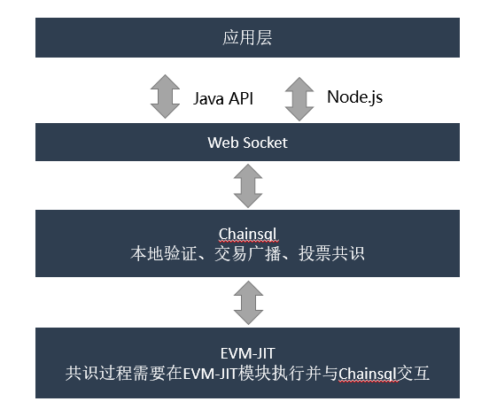

智能合约
#####################################

引言
*************************************

编写目的
+++++++++++++++++++++++++++++++++++++

设计Chainsql中智能合约的实现方案，通过此文档可对Chainsql中的智能合约有深入的了解。

背景
+++++++++++++++++++++++++++++++++++++

基于以下技术实现：

 * Ripple 的区块链技术实现
 * 以太坊客户端\ `C++实现 <https://github.com/ethereum/aleth>`_
 * 以太坊虚拟机EVM
 * llvm框架

总体说明
*************************************

阶段目标
+++++++++++++++++++++++++++++++++++++

 1. 一期实现对以太坊智能合约的支持，兼容用solidity语言编写的智能合约。
 2. 二期：

    i.  实现在智能合约中支持Chainsql对表的操作；
    ii. 支持在智能合约中操作通过网关发行的代币，支持在智能合约中发行网关代币及相关操作。

修改方案
+++++++++++++++++++++++++++++++++++++

一期修改方案：

 * 底层：在Chainsql最新源码基础上添加对以太坊智能合约的支持，集成evm中JIT的实现模块，llvm编译模块，并添加新的交易类型与虚拟机进行交互，最终实现可通过交易完成合约的发布、调用。
 * 上层：上层提供Node.js与Java版本的api，在原chainsql api的基础上增加对智能合约的支持。

系统架构
+++++++++++++++++++++++++++++++++++++

基本功能
*************************************

合约部署
+++++++++++++++++++++++++++++++++++++

 * 支持通过chainsql节点部署智能合约，通过api进行操作的步骤如下：

    i.   用户编写solidity合约。
    ii.  编译solidity代码，得到可执行字节码。
    iii. 调用chainsql提交部署智能合约交易，并订阅交易状态。
    iv.  交易共识通过触发回调，合约部署成功。
    v.   通过查询合约交易信息，获得合约地址。

合约调用
+++++++++++++++++++++++++++++++++++++

 * 合约部署成功后，api层可调用合约对象中的方法(与solidity中的定义一致)来调用合约，合约的调用方式分为两种：

    i.  set方法，改变合约状态，这种方法需要以发送交易的方式进行调用。
    ii. get方法，不改变合约状态，这种方法可直接调用chainsql提供的接口来获取返回结果。

给合约地址转账
+++++++++++++++++++++++++++++++++++++

 * 与其它账户地址不同，合约地址在Chainsql网络中是可以是没有ZXC余额的。
 * 不能通过Payment类型的交易给合约地址转账。
 * Api层提供了\ ``payToContract``\ 接口对合约地址进行转账。
 * 合约中必须提供\ ``payable``\ 修饰的\ ``fallback``\ 函数，不然合约地址无法接受转账。

Gas
+++++++++++++++++++++++++++++++++++++

 * Chainsql中的智能合约执行也是消耗\ ``Gas``\ 的，\ ``Gas``\ 计算规则与以太坊中的一致。
 * Chainsql中用户不可以设置\ ``GasPrice``\ ，只可以设置\ ``GasLimit``\ ，交易出现排队时，根据交易中\ ``Fee``\ 字段的值排列优先级。
 * Chainsql中的\ ``GasPrice``\ 由系统决定，并且会随当前网络负载而变化。
 * GasPrice初始值为10drop(1e-5 ZXC)，最大值为20drop。

支持表操作
+++++++++++++++++++++++++++++++++++++

 * 支持在智能合约中进行表的各种操作。

支持网关发行代币、代币流通。
+++++++++++++++++++++++++++++++++++++

 * 支持智能合约中进行网关设置、信任网关、代币的转账等。

性能指标
*************************************

``TODO``

实现
*************************************

LedgerNode修改：AccountRoot
+++++++++++++++++++++++++++++++++++++

 * 合约地址生成使用原有地址计算规则，以部署合约帐户与帐户当前交易序号为原像，合约只有地址，无公私钥。
 * 合约在Chainsql中也是以\ ``AccountRoot``\ 这种\ ``LedgerNode``\ 的形式存在。
 * \ ``AccountRoot``\ 增加了下面的可选字段：

.. list-table::

    * - **字段名**
      - **类型**
      - **说明**
    * - StorageOverlay
      - STMap256
      - 合约中的存储
    * - ContractCode
      - STBlob
      - 合约中的字节码，调用合约时使用

增加交易类型Contract
+++++++++++++++++++++++++++++++++++++

 * Chainsql中智能合约的部署、修改状态的方法调用，都要通过Contract类型的交易进行。
 * 交易中的字段说明（略过常规字段如\ ``Account``\ 、\ ``Sequence``\ 等）：

.. list-table::

    * - **字段名**
      - **类型**
      - **是否必填**
      - **说明**
    * - ContractOpType
      - UINT16
      - 必填
      - 操作类型，1为合约部署，2为合约调用
    * - ContractData
      - STBlob
      - 必填
      - 部署合约/调用合约时的输入值
    * - Gas
      - UINT32
      - 必填
      - 部署/调用合约交易时，需设置的Gas上限
    * - ContractAddress
      - STACCOUNT
      - 选填
      - 合约地址，调用合约时填写
    * - ContractValue
      - STAMOUNT
      - 选填
      - 本次交易要给合约地址转账的金额

增加接口contract_call
+++++++++++++++++++++++++++++++++++++

 * Chainsql中不修改合约状态的方法调用，需要通过\ ``contract_call``\ 接口来实现。
 * 接口中的字段说明：

.. list-table::
    :align: left

    * - **字段名**
      - **类型**
      - **说明**
    * - account
      - 字符串
      - 调用合约的地址
    * - contract_address
      - 字符串
      - 合约地址
    * - contract_data
      - 字符串
      - 合约数据

自定义数据类型STMap256
+++++++++++++++++++++++++++++++++++++

 * key与value均为uint256类型的map，用于存储合约中的状态。

RPC接口
*************************************

 * :ref:`合约部署交易 <rpc部署合约>`
 * :ref:`合约的调用（Set） <rpc调用合约>`
 * :ref:`合约的调用（Get）<rpc查询合约>`

Websocket接口
*************************************

 * :ref:`合约部署交易 <websocket部署合约>`
 * :ref:`合约的调用（Set） <websocket调用合约>`
 * :ref:`合约的调用（Get）<websocket查询合约>`

对表的支持
*************************************

.. note::
    | ``owner`` 为address类型，表的拥有者地址。
    | ``raw`` 为字符串类型，非16进制，JSON格式。

创建表
+++++++++++++++++++++++++++++++++++++

.. code-block:: javascript

    owner.create("table_name", "create raw string");

    // example
    function createTable(string name, string raw) public {
        msg.sender.create(name, raw);
    }

插入
+++++++++++++++++++++++++++++++++++++

.. code-block:: javascript

    owner.insert("table_name", "insert raw string");

    // example
    function insertToTable(address owner, string name, string raw) public {
        owner.insert(name, raw);
    }

删除行
+++++++++++++++++++++++++++++++++++++

.. code-block:: javascript

    // delete参数代表删除条件
    owner.delete("table_name", "raw string");

    // example
    function deleteFromTable(address owner, string name, string raw) public {
        owner.delete(name, raw);
    }

修改
+++++++++++++++++++++++++++++++++++++

.. code-block:: javascript

    // update需要两个参数
    owner.update(table_name, "raw string", "get raw");

    // example
    function updateTable(address owner, string name, string getRaw, string updateRaw) public {
        owner.update(name, updateRaw, getRaw);
    }

查询
+++++++++++++++++++++++++++++++++++++

 * 查询返回一个句柄，需要自定义一个类型，如handle（或者直接使用uint256）。
 * handle不可作为函数返回值返回（只能作为临时对象使用），也不能作为成员变量使用（作为成员变量使用，跨交易时，会获取不到内容）。
 * 可根据查询得到的句柄去获取查询结果中的字段值。
 * 提供遍历方法，可根据句柄遍历查询结果。

.. code-block:: javascript

    uint256 handle = owner.get(tableName, raw);
    uint row = db.getRowSize(handle);
    uint col = db.getColSize(handle);
    string memory xxx;
    for (uint i = 0; i < row; i++)
    {
        for (uint j = 0; j < col; j++)
        {
            string memory y1 = (db.getValueByIndex(handle, i, j));
            string memory y2 = (db.getValueByKey(handle, i, field));
        }
    }

事务相关
+++++++++++++++++++++++++++++++++++++

 * 增加两个指令beginTrans()、commit()，指令之间的部分组成事务。
 * 两个指令之间的操作逐行执行。

.. code-block:: javascript

    db.beginTrans();
    owner.insert(name.raw);
    uint256 handle = owner.get(name, getRaw);
    if (db.getRowSize(handle) > 0) {
        owner.update(name, updateRaw, getRaw);
    }

    ...
    // every op is alone

    db.commit();

授权
+++++++++++++++++++++++++++++++++++++

 * 必须由表的拥有者发起。

.. code-block:: javascript

    owner.grant(user_address, table_name, "grant_raw");

    // example
    function grantTable(string name, address user, string raw) public {
        msg.sender.grant(user, name, raw);
    }

删除表
+++++++++++++++++++++++++++++++++++++

 * 必须由表的拥有者发起。

.. code-block:: javascript

    owner.drop("table_name");

    // example
    function dropTable(string name) public {
        msg.sender.drop(name);
    }

重命名表
+++++++++++++++++++++++++++++++++++++

 * 必须由表的拥有者发起

.. code-block:: javascript

    owner.rename("table_name", "new_name");

    //example
    function renameTable(string name,string newName) public {
        msg.sender.rename(name, newName);
    }

代币接口（TODO）
*************************************

合约信任发行币网关
+++++++++++++++++++++++++++++++++++++

 * 可设置由合约拥有者发起

.. code-block:: javascript

    modifier onlyOwner {
        require(msg.sender == owner);
        _;
    }

    function trust(address gateway, string coin, uint amount) public onlyOwner {
        msg.sender.trustSet(gateway, coin, amount);
    }

给合约转网关代币
+++++++++++++++++++++++++++++++++++++

 * 如果fallback函数是\ ``payable``\ 的可以转直接转账系统币，转网关币也需要fallback？

查询网关代币余额
+++++++++++++++++++++++++++++++++++++

.. code-block:: javascript

    function gatewayBalance(address addr, address gateway, string coin) public returns(uint amount) {
        return addr.gatewayBalance(gateway, coin);
    }

转账发行币
+++++++++++++++++++++++++++++++++++++

 * 接收网关代币的方法必须是\ ``payable``\ 的。
 * 先将代币转给合约，然后合约内调用\ ``transfer``\ /\ ``send``\ 转出

.. code-block:: javascript

    function transfer(address to, address gateway, string coin, uint amount) public payable {
        uint balance = gatewayBalance(msg.sender, gateway, coin);
        require(balance > amount, "balance insufficient");
        to.transfer(gateway, coin, amount);
    }
